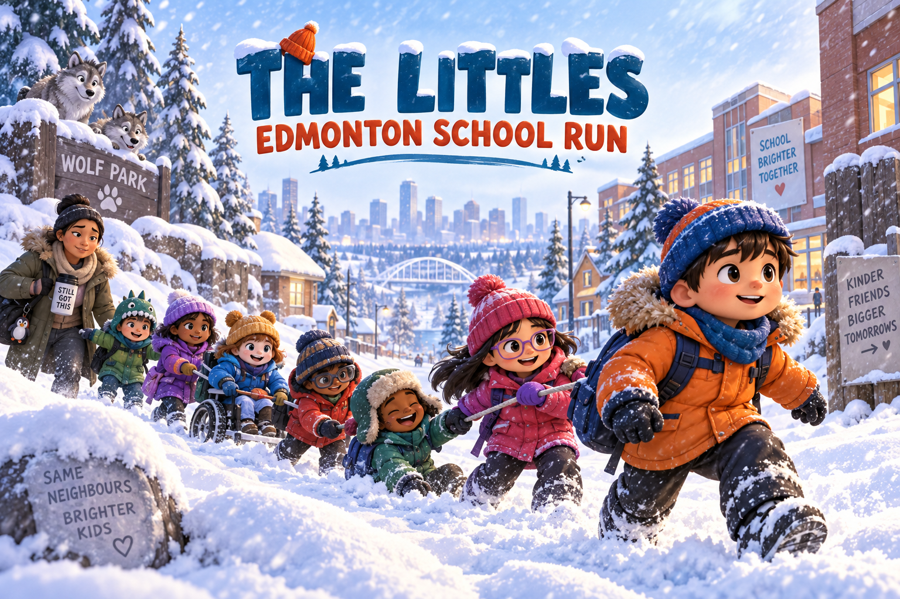
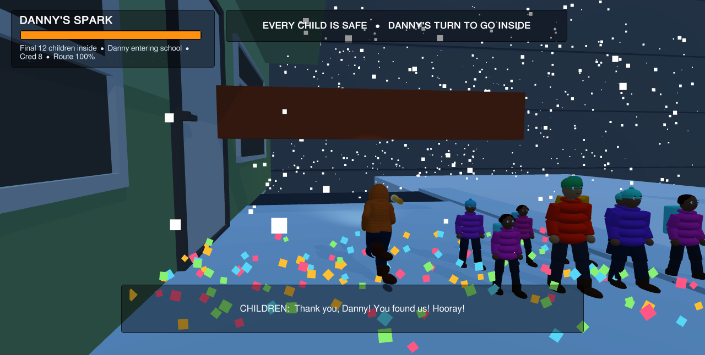

# The Littles: Edmonton School Run

Guide Danny through an Edmonton whiteout, find missing children, and bring the
whole neighbourhood safely to school—together.

## The story

The game was inspired by a real person named Danny, who offered kindness and a
safe place during a difficult moment in the creator's life. It is a thank-you to
Danny and to Edmonton: a city of difficult winters, lasting friendships, and
people who help neighbours, strangers, and visitors.

This is deliberately a nonviolent game. Danny does not save the world by
fighting. He helps children through dangerous weather, keeps a growing group
together, and does his best for his community.

## Play

The Android APK and Linux build are published on the repository's Releases
page. The Android version can be installed directly while its Google Play
listing completes account verification and testing.

[Watch the development preview on YouTube](https://youtu.be/FBpiApeehDA).

The full three-level game is free. An optional RevenueCat-powered
**Neighbourhood Supporter Pack** unlocks a warm cosmetic community glow and
does not restrict any gameplay.

## Features

- Three connected levels across snowy streets, stairs, parks, and river valley
- Missing-child searches with an on-screen kid radar
- Physical groups that follow Danny and enter school in a visible procession
- Snowstorms, darkness, flashlight energy, traffic, wildlife, and rescues
- Keyboard, controller, and Android touch controls
- A complete finale with cheering children, confetti, and Mom's proud message
- Automated whole-game and finale verification drivers
- RevenueCat purchase, entitlement, and restore handling

## Technology

- Unity 6.5 (`6000.5.6f1`)
- C#
- Android and Linux
- RevenueCat Purchases Unity SDK 9.11.1
- RevenueCat Test Store for pre-release purchase verification
- OpenAI ChatGPT and Codex as disclosed development collaborators

## Source layout

- `Assets/Scripts` — gameplay, interface, mobile controls, tests, and RevenueCat integration
- `Assets/Editor` — scene construction and repeatable build tools
- `Assets/Scenes` — Edmonton River Valley school-run scene
- `docs` — screenshots, audit evidence, setup notes, and submission copy

## RevenueCat setup

The integration expects a **public** RevenueCat SDK key in:

`Assets/Resources/RevenueCatPublicKey.txt`

The RevenueCat project must provide a current offering containing a product
attached to the `supporter` entitlement. Test builds use a Test Store key;
production store builds must use the platform-specific public Android key.
Never place a RevenueCat secret key in the project.

## Automated verification

The repository includes command-line audit drivers for the entire route,
stairs, crowd following, and the final school sequence. The latest finale audit
completed with all 12 Level 3 children safely inside, eight visible cheering
children, 160 confetti pieces, Mom's proud voice line, and zero runtime errors.

See [`docs/finale-audit-report.txt`](docs/finale-audit-report.txt).

## Asset note

Some licensed third-party art used by the distributable game is intentionally
excluded from this public source repository. See
[`THIRD_PARTY_ASSETS.md`](THIRD_PARTY_ASSETS.md). The release builds include the
licensed compiled content required to play.

## Acknowledgements

Thank you to Danny, the people of Edmonton, the Devpost community, RevenueCat,
and OpenAI. Edmonton, I remember you.

## License

Original source code in this repository is released under the MIT License.
Third-party assets and trademarks are not covered by that license.
